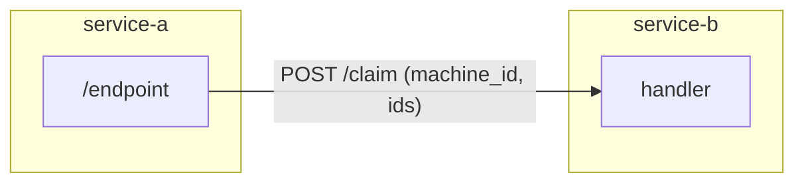
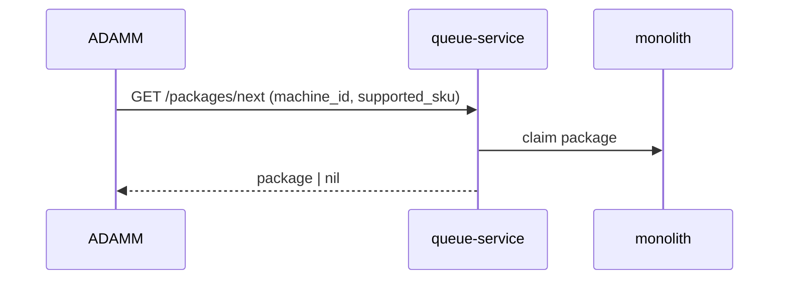
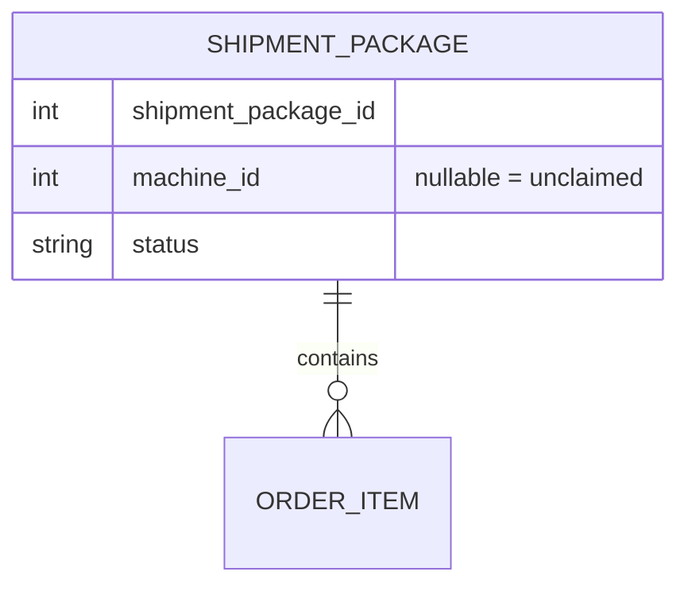
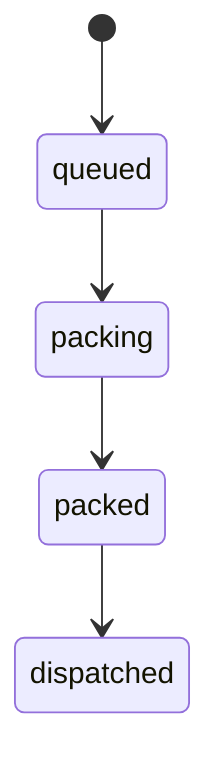

# Skill: doc-diagrams

## What I do

Help pick and draw mermaid diagrams that make a technical document clearer, without
drifting from what the code actually does. A wrong diagram is worse than none: readers
trust pictures.

## When to use me

Whenever structure or flow is faster to grasp as a diagram than as prose. Do not diagram
for decoration; each diagram should answer a specific question the reader will have.

## Ground rules

- **Accuracy first.** Every node is a real component/service/module; every labelled edge is
  a real call, message, or dependency found during `doc-investigation`. If an edge is
  inferred rather than verified, say so in the surrounding text.
- **Label the edges.** "A → B" says little; "A -- GET /packages/next --> B" says what and
  how. Use the real endpoint/event/function names.
- **One question per diagram.** Keep each diagram focused. Split rather than cram.
- **Readable size.** If a diagram exceeds roughly 12-15 nodes, it is probably two diagrams.
- Prose still carries the detail a diagram cannot; the diagram is an index, not the spec.

## Choosing the type

| Question the reader has | Diagram type |
| --- | --- |
| How do the parts fit together / who calls whom? | `flowchart` (architecture) |
| What is the order of interactions over time? | `sequenceDiagram` |
| How is the data structured and related? | `erDiagram` |
| What states can this move between? | `stateDiagram-v2` |
| How is work broken down over time? | `gantt` (rarely, for plans) |

## Patterns

Architecture / component flow (group by service with `subgraph`, label the calls):

Sequence (end-to-end interaction; note sync vs async with solid vs dashed arrows):

Data model (only the fields that matter to the reader):

State (lifecycle of an entity):

## House style

- **No em dashes** in labels or surrounding prose; use "-" or parentheses.
- Keep node text short; put the detail in the document body, cited with `path:line`.
- Match terminology to the code and the rest of the document exactly.
