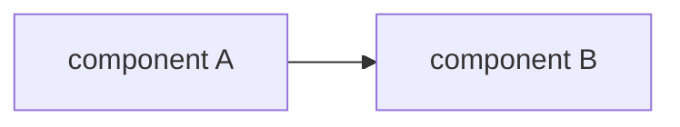

# <System / service / process name>

> One-line description of what this document covers and its status (e.g. "Reference for the
> ADAMM packing pipeline, as of <date>. Verified against `main`.").

## Overview
A few lines: what this system/process is, what problem it solves, and where it sits in the
wider platform. Assume the reader knows the platform in general but not this area.

## Scope and audience
- **Audience**: who this is written for and what they are assumed to know.
- **In scope**: what this document covers.
- **Out of scope**: what it deliberately does not cover (and where to look instead).

## Architecture
The real components and how they connect. Lead with a diagram when it conveys structure
faster than prose (see the `doc-diagrams` skill), then explain the parts the diagram cannot.
Name real services, repos, and modules.

## Components
For each significant component: what it is, what it owns, and the key files/entry points.

| Component | Responsibility | Key files / entry points |
| --- | --- | --- |
| ... | ... | `path/to/file.py:NN` |

## Data and control flow
Trace at least one representative path end to end: entry point, what calls what, where data
is transformed, where state is written, what comes out. Note synchronous vs asynchronous
hops. A sequence diagram often works well here.

## Interfaces and contracts
The seams other code relies on: HTTP endpoints, event schemas, key function signatures,
request/response shapes, and error/failure responses. Enough that a caller could integrate
without reading the implementation.

## Data model and persistence
Tables/collections, key fields, important relationships and states, and where the source of
truth lives. An ER diagram helps when relationships matter.

## Configuration and deployment
Env vars, feature flags, config files, how and where the thing runs. Only what a reader
needs to operate or reason about it.

## Operational concerns and failure modes
Timeouts, retries, race conditions, rollback/void paths, degraded and fallback behaviour,
and known gotchas. The parts that matter in production.

## Edge cases and open questions
Anything unresolved, anything inferred rather than verified (labelled as such), and anything
that could change these findings later (e.g. "verified against v2.3, may differ in v3").

## References
The real files, services, endpoints, external docs, RFCs, and PRs consulted, with paths and
line numbers where applicable.
